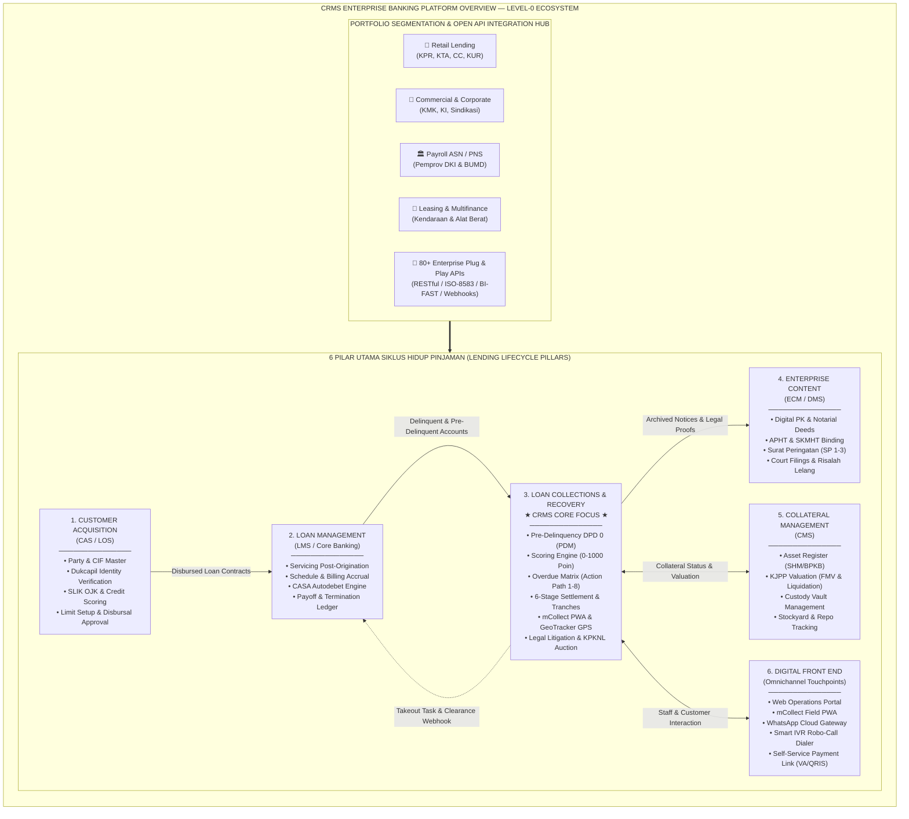

# Collection & Recovery Management System (CRMS)
### Segmentasi: Perbankan Ritel, Komersial & Payroll (Bank DKI / Bank Jakarta & Sektor Finansial)

[](https://golang.org)
[](https://react.dev)
[](https://www.postgresql.org)
[](https://tailwindcss.com)
[](https://github.com/nurkholim15-bot/crms)

---

## 📌 Ringkasan Sistem

**Collection & Recovery Management System (CRMS)** adalah platform enterprise perbankan terintegrasi yang dirancang khusus untuk mengelola seluruh siklus hidup penagihan dan pemulihan kredit bermasalah (*Non-Performing Loan* / NPL) pada portofolio perbankan modern (KPR, KMK, KTA, KUR, dan Kartu Kredit), dengan fokus khusus pada segmen **Payroll ASN/PNS Pemprov DKI** serta kepatuhan ketat terhadap regulasi OJK dan UU Perlindungan Data Pribadi (PDP No. 27/2022).

---

## 🌐 Diagram Ekosistem Lending Perbankan (Level-0 Ecosystem)

Diagram Level-0 di bawah ini menggambarkan posisi strategis **CRMS** di dalam arsitektur digital lending perbankan end-to-end yang mengintegrasikan seluruh siklus kredit:



---

## 🔄 Diagram Aliran Data ETL Core System ke CRMS (Level-1 Pipeline)

Diagram Level-1 memetakan transfer data berkala (*Nightly EOD Batch*) dan aliran transaksi real-time (*CDC / Webhook*) dari core systems ke dalam repositori CRMS:

```mermaid
flowchart TB
    subgraph SOURCES["CORE SOURCE SYSTEMS (SISTEM SUMBER DATA PERBANKAN)"]
        direction LR
        SRC_CAS["1. Customer Acquisition (CAS/LOS)<br/>• CIF Master, NIK KTP, Profil Nasabah<br/>• Instansi ASN / Payroll Employer<br/>• Kontak Telepon & Emergency Contact<br/>• SLIK Score & Approved Limit"]
        SRC_LMS["2. Loan Management (LMS/CBS)<br/>• No Kontrak, Baki Debet, Tenor<br/>• DPD, Tunggakan Pokok/Bunga/Denda<br/>• CASA Autodebet & Tukin Calendar<br/>• Historical Repayment Ledger"]
        SRC_CMS["3. Collateral Management (CMS)<br/>• Agunan SHM/SHGB/BPKB, LTV<br/>• Penilaian KJPP (Pasar & Likuidasi)<br/>• Akta APHT & Fidusia Notariil<br/>• Lokasi Fisik Agunan & Vault"]
        SRC_ECM["4. Content Management (ECM)<br/>• Berkas Digital Perjanjian Kredit<br/>• Sertifikat Agunan & Surat Kuasa<br/>• Arsip Somasi & Berkas Hukum"]
        SRC_PAY["5. Payment Switch (BI-FAST/VA)<br/>• Real-Time Payment Transaction Stream<br/>• Setoran M-Banking / QRIS Dinamis<br/>• Webhook Event Settlement"]
    end

    subgraph ETL_PIPELINE["INTEGRATION & ETL PIPELINE LAYER (CRMS DATA INTEGRATOR)"]
        direction TB
        
        subgraph INGESTION["1. EXTRACTION & INGESTION STAGE"]
            EXT_BATCH["Nightly EOD Batch Extractor<br/>(Cron 02:00 WIB / SFTP & REST mTLS)"]
            EXT_CDC["Real-Time Event Listener / Webhook<br/>(Payment Stream & CASA Balance)"]
        end

        subgraph CLEANSING["2. STAGING & DATA CLEANSING"]
            CLEAN_VAL["Schema Validation & Type Normalization"]
            CLEAN_MASK["UU PDP Masking Guard (PII Protection)"]
            CLEAN_DEDUP["Deduplication & Anomaly Cleansing"]
        end

        subgraph ENRICHMENT["3. TRANSFORMATION & ENRICHMENT ENGINES"]
            ENR_360["Customer 360 Aggregator<br/>(Cross-Facility Liability Consolidation)"]
            ENR_STAMP["Case Stamping Engine<br/>(Combo 1: KPR+KPA, Combo 2: KTA+CC)"]
            ENR_PDM["Pre-Delinquency Evaluator<br/>(CASA Balance Sufficiency & ASN Payroll Watcher)"]
            ENR_SCORE["Behavioral Scoring Engine<br/>(Calculates Risk Score: 0 - 1000 Poin)"]
            ENR_PATH["Action Path Classifier<br/>(AP Grade 1 - 8 & Champion vs Challenger)"]
        end

        subgraph LOADING["4. PERSISTENCE LOADING (crms_db)"]
            LOAD_UPSERT["Transactional Batch Upsert Engine<br/>• public.customers<br/>• public.agreements<br/>• public.pre_delinquency_accounts<br/>• public.overdue_accounts"]
        end

        INGESTION ==> CLEANSING
        CLEANSING ==> ENRICHMENT
        ENRICHMENT ==> LOADING
    end

    subgraph TARGET_QUEUES["CRMS OPERATIONAL WORK QUEUES & WORKBENCHES"]
        direction LR
        Q_PDM["Queue DPD 0 (PDM)<br/>• Gentle WA Auto-Reminder<br/>• CASA Insufficiency Alert"]
        Q_DIGITAL["Queue DPD 1-14 (Low Risk)<br/>• WhatsApp Bot Blaster<br/>• Smart IVR Robo-Call"]
        Q_DESK["Queue DPD 4-30 (Medium Risk)<br/>• Desk Telephony CRM<br/>• Guided Dialogue Script"]
        Q_FIELD["Queue DPD 14-90 (High Risk)<br/>• mCollect Field Queue<br/>• GeoTracker Real-Time GPS"]
        Q_REMEDIAL["Queue DPD 90+ (Remedial)<br/>• 6-Stage Legal Recourse<br/>• 8-Stage KPKNL Auction<br/>• 6-Stage Settlement Tranches"]
    end

    subgraph REVERSE_SYNC["REAL-TIME REVERSE SYNC & TAKEOUT TASK"]
        direction LR
        REV_PAY["Debitur Bayar via VA / BI-FAST"] --> REV_HOOK["Instant Webhook POST /confins/simulate-payment"]
        REV_HOOK --> REV_CLEAR["Auto Clearance Saldo Tunggakan = Rp 0"]
        REV_CLEAR --> REV_CANCEL["Instant Takeout Task: Cabut Akun dari Antrean Kolektor (<5 Menit)"]
        REV_CANCEL --> REV_RECEIPT["Kirim Bukti Bayar Resmi (PIS) via WhatsApp ke Nasabah"]
    end

    SRC_CAS & SRC_LMS & SRC_CMS & SRC_ECM --> EXT_BATCH
    SRC_PAY --> EXT_CDC
    LOADING ==> TARGET_QUEUES
    TARGET_QUEUES -.->|Interaksi Penagihan & Janji Bayar PTP| ETL_PIPELINE
    SRC_PAY ==> REVERSE_SYNC
    REVERSE_SYNC -.->|Update Status Akun Lunas| LOADING
    REVERSE_SYNC -.->|Notifikasi Pembatalan Kunjungan Lapangan| Q_FIELD
```



---

## 🏛️ Arsitektur Sistem 5-Tier (5-Tier Enterprise System Architecture)

Sistem CRMS dibangun dengan pendekatan *surrounding intelligent layer* yang menghubungkan Core Banking System (CBS) dengan saluran digital omnichannel dan armada penagihan lapangan:

```mermaid
flowchart TB
    subgraph TIER1["TIER 1: PRESENTATION & TOUCHPOINTS (FRONTEND CLIENTS)"]
        direction LR
        UI_SPA["Web SPA Operations Portal<br/>(React 18 + Vite + Tailwind CSS)<br/>• Overdue Matrix DPD 1-30<br/>• Unified Customer 360°<br/>• VIP Desk (AR Head Portal)<br/>• Pre-Delinquency DPD 0 Dashboard<br/>• Legal (6-Stage) & Repo (8-Stage)"]
        UI_MOB["mCollect Field Workbench (PWA)<br/>• Mobile Field Visit Queue<br/>• Payment Recording & Geotagging<br/>• Digital PIS WhatsApp Slip<br/>• QRIS / VA Link Generator<br/>• Foreclosure Payoff Calculator"]
        UI_GEO["GeoTracker Command Center<br/>• Live Jakarta Vector Map<br/>• Animated Route Playback<br/>• Time Analytics & Velocity<br/>• Idle Outlier Alert (>120m)"]
        UI_SUP["Supervisory & Admin Console<br/>• Agency Onboarding & SLA<br/>• Balanced Round-Robin Queue<br/>• Out of Office (OOO) Delegation<br/>• Easy Rule & Scoring Config"]
    end

    subgraph TIER2["TIER 2: API GATEWAY & SECURITY ROUTING LAYER"]
        direction TB
        NGINX["Nginx Reverse Proxy & SSL Offloader<br/>(External HTTPS Port 3030 / WSS WebSocket / TLS 1.3)"]
        GW_SEC["Security Middleware & Traffic Controller<br/>• JWT Token Verification & Session State<br/>• Strict CORS & HTTP Security Headers<br/>• RBAC Guard (ADMIN, AR_HEAD, COLLECTOR)<br/>• Rate Limiting & DoS Mitigation<br/>• JSON Audit Logger with Client Tracing"]
        NGINX --> GW_SEC
    end

    subgraph TIER3["TIER 3: CORE DOMAIN APPLICATION SERVICES (GOLANG GIN ENGINE)"]
        direction TB
        subgraph ENGINES["Modular Domain Engines (:8030)"]
            DE_ENG["Decision & Scoring Engine<br/>• 0-1000 Behavioral Scoring<br/>• Action Path Matrix (Grade 1-8)<br/>• Champion vs Challenger Router<br/>• Dynamic Re-Evaluation Sandbox"]
            PDM_ENG["Pre-Delinquency Engine (PDM)<br/>• CASA Balance Watcher (H-3..H-0)<br/>• ASN Tukin/Payroll Calendar<br/>• First Payment Default (FPD) Alert"]
            SETTLE_ENG["Settlement & Rebate Engine<br/>• 6-Stage Lifecycle State Machine<br/>• Multi-Tranches Allocator (1-6)<br/>• Rule 78 Rebate Calculator<br/>• Approval Authority Limit Matrix"]
            SUPER_ENG["Supervisory & Workforce Engine<br/>• Balanced Round-Robin Allocator<br/>• Capacity Tracker (Opt/Overload)<br/>• Out-of-Office (OOO) Delegator<br/>• Agency SLA & Recovery Monitor"]
            FIELD_ENG["mCollect & Telemetry Service<br/>• GPS Heartbeat Telemetry Ingestion<br/>• Anomaly Detection (Idle/Jump)<br/>• Route Point Aggregator & Playback<br/>• Digital Receipt Slip (PIS) Engine"]
            OMNI_ENG["Omnichannel Messaging Gateway<br/>• WhatsApp Cloud API / Fonnte<br/>• Smart IVR Robo-Call Dialer<br/>• SMS Failover Gateway<br/>• Dynamic Persona Script Parser"]
            LEGAL_ENG["Legal & Liquidation Manager<br/>• 6-Stage Litigation Workflow<br/>• 8-Stage Auction & Repossession<br/>• Stockyard & KJPP Appraisal Tracker"]
            RECON_ENG["Payment Recon & Takeout Engine<br/>• Real-Time Webhook Listener<br/>• Instant Balance Match-off<br/>• <5 Min Task Cancellation (Anti-Overcollect)"]
        end
    end

    subgraph TIER4["TIER 4: PERSISTENCE & DATA GOVERNANCE LAYER"]
        direction TB
        DB_PG[("PostgreSQL 14+ / 18+ Relational Database (crms_db)<br/>Connection Pool (MaxOpen: 50, MaxIdle: 10, Lifetime: 1h)")]
        subgraph TABLES["Core Relational Schemas & Entities"]
            T_CUST["Customers, Agreements, Overdue Accounts, Pre-Delinquency"]
            T_ACT["Collection Activities, Payment Slips (PIS), Decision Rules"]
            T_LEGAL["Legal Cases, Repo Cases, Settlement Proposals & Tranches"]
            T_GEO["Collector Geo Locations, Route Points, Agencies, Delegations"]
            T_SEC["Users, Global Parameters, Audit Log Trails"]
        end
        DB_PG --- TABLES
    end

    subgraph TIER5["TIER 5: EXTERNAL ENTERPRISE INTEGRATION BACKBONE"]
        direction LR
        EXT_CBS["Core Banking System (CBS)<br/>• Batch EOD 02:00 AM Sync<br/>• Real-Time Loan Ledger REST API"]
        EXT_PAY["Payment Infrastructure<br/>• BI-FAST Payment Switching<br/>• Bank Virtual Account (VA)<br/>• Dynamic QRIS Gateway"]
        EXT_COMM["Communication Networks<br/>• WhatsApp Business API<br/>• Telecom Smart IVR / PSTN<br/>• National SMS Center"]
        EXT_GOV["Registry & Judicial Panels<br/>• Dukcapil KTP Identity API<br/>• ATR/BPN Hak Tanggungan<br/>• KPKNL Balai Lelang Negara<br/>• Panel KJPP & Law Firm Rekanan"]
    end

    TIER1 ==>|HTTPS REST / WSS| TIER2
    TIER2 ==>|Internal HTTP Proxy :8030| TIER3
    TIER3 ==>|GORM / SQL Connection Pool :5432| TIER4
    TIER3 <==>|Mutual TLS / REST / Webhooks| TIER5
```



---

## 🚀 10 Modul Enterprise Utama

1. **Unified Customer 360° View**: Agregasi total eksposur fasilitas kredit lintas produk (lancar vs overdue), informasi agunan (SHM/BPKB), serta linimasa interaksi omnichannel dalam satu CIF tunggal.
2. **Decision Engine & Scoring Model (0–1000 Poin & Action Path Grade 1–8)**: Klasifikasi risiko gagal bayar multi-faktor (`LOW_RISK` $\ge 700$, `MEDIUM_RISK` $450-699$, `HIGH_RISK` $< 450$, `VIP`) berbasis 5 parameter resmi (Payment History 35%, Current DPD 25%, DSR 20%, Facility/Collateral 10%, Stabilitas ASN DKI 10%). Menghubungkan skor ke Grade (Action Path 1–8 & VIP) via pembagian traffic *Champion* (Grade 1 & 2 baseline 80%) vs *Challenger* (Grade 3–8 adaptif 20%), lalu menginterseksikannya dengan 10 Bucket DPD (`-3-0` s.d `> 150`) untuk penugasan PIC otomatis (WA, Robot, DC, FC, SFC, Senior Field Collector, Remedial, Special Team).
3. **Settlement 6-Stage Lifecycle & Multi-Tranches**: Manajemen kompromi diskon pelunasan terstruktur (Initiate -> Schedule Multi-Tranches 1-6 termin -> Payment Plan -> Recommend & Approval Matrix berjenjang -> Tracking -> Closure Match-off).
4. **Supervisory Control, Capacity Planning & Reassign Collector**: Distribusi antrean seimbang (*Balanced Round-Robin*), pemantauan beban kerja harian kolektor (optimal 25 akun), pendelegasian wewenang sementara (*Out of Office / OOO*), pengalihan tugas penagihan antar kolektor (*Reassign Collector*) dengan audit trail lengkap, serta onboarding agensi penagihan eksternal dan pemantauan SLA.
5. **Collector Workbench & CMS Incentive Engine**: Antarmuka terpadu kolektor dengan **Task List** (alokasi akun), **Today's Plan** (urutan rute & target harian), **Customer Form** (profil 360°, kontak, histori kunjungan, dan pencatatan aksi lapangan), perekaman bayar tunai/VA/QRIS, penerbitan kuitansi resmi digital (PIS) ke WhatsApp, tautan bayar mandiri 24 jam, kalkulator pelunasan dipercepat (*Foreclosure Rule 78*), serta **CMS Incentive Engine** berbasis **Bucket Flow Rate Modifier** (Bonus 1.2x atau Penalti 0.8x/0.5x).
6. **GeoTracker GPS Monitoring**: Peta vektor interaktif DKI Jakarta menampilkan armada kolektor secara *real-time*, pemutaran ulang rute animasi (*animated route playback*), analisis waktu produktif (*time analytics*), dan deteksi anomali waktu diam (> 120 menit).
7. **Pre-Delinquency Management (PDM - DPD 0)**: Pengawasan dini sebelum jatuh tempo (H-3 s.d H-0), pengecekan saldo autodebet CASA, kalender transfer gaji/tukin ASN Pemprov DKI, dan pengingat ramah otomatis via WhatsApp.
8. **Legal Recourse & Asset Liquidation**: Alur perkara hukum perbankan terstandarisasi dalam 6 tahapan litigasi perdata serta 8 tahapan eksekusi lelang agunan di KPKNL.
9. **Omnichannel WhatsApp Gateway (Arsitektur Teruji)**: Pengiriman notifikasi tagihan otomatis melalui API Gateway (Meta Cloud API / Fonnte) dan URL fallback langsung dengan skrip terpersonalisasi dan audit trail permanen.
10. **Instant Payment Takeout Task**: Webhook rekonsiliasi pembayaran real-time via Virtual Account / BI-FAST yang seketika mematikan antrean penagihan (< 5 menit) guna mencegah penagihan ulang (*post-payment disturbance*).

---

## 📱 Fitur Kolektor Terpadu & Kalkulasi Insentif CMS Flow Rate

Sistem CRMS mengimplementasikan alur kerja kolektor lapangan dan perhitungan insentif modern berbasis kinerja risiko:

### 1. Siklus Kerja Kolektor Lapangan (Collector Workflow)
* **📋 Task List**: Daftar seluruh tugas penagihan yang dialokasikan ke kolektor berdasarkan algoritma *Decision Engine* dan beban kerja. Dilengkapi filter bucket, status, pencarian instan, dan fitur *Multi-Select* untuk menambahkan akun secara massal ke jadwal harian.
* **📅 Today's Plan**: Jadwal rencana kerja harian yang dipilih kolektor. Disusun berdasarkan urutan rute perjalanan (*Route Sequence #1, #2, #3...*) dan estimasi waktu (*09:00 WIB, 11:00 WIB*). Memuat metrik target vs realisasi harian serta status dinamis (*PLANNED*, *IN_PROGRESS*, *VISITED*, *PTP*, *PAID*).
* **📄 Customer Form**: Formulir detail interaktif yang muncul saat baris task diklik. Menyajikan data profil debitur (CIF, NIK, telepon, WhatsApp instan, alamat domisili, peta), rincian kredit (plafon, angsuran bulanan, sisa tenor), status tunggakan (DPD, bucket, risk score), serta form eksekusi hasil kunjungan (pencatatan status kontak, janji bayar PTP, terbitkan kuitansi PIS digital, buat tautan QRIS/VA, dan simulator pelunasan Rule 78).
* **🔄 Reassign Collector**: Fitur supervisi / AR Head untuk memindahkan akun penagihan antar kolektor (tunggal atau massal) dengan pencatatan alasan operasional (*OVERLOAD*, *SICK_LEAVE*, *AREA_ROTATION*, *PERFORMANCE_ESCALATION*) serta *Audit Trail Log* permanen.

### 2. CMS Incentive Engine Berbasis Bucket Flow Rate Modifier
Dalam industri penagihan perbankan modern, kinerja kolektor tidak hanya dinilai dari nominal uang yang tertagih, tetapi juga kemampuan menahan laju penurunan kualitas portofolio (*Bucket Flow Rate*). Semakin rendah flow rate, kinerja kolektor semakin baik (bonus). Sebaliknya, jika flow rate tinggi (membiarkan debitur lolos ke bucket lebih macet), insentif dipotong (penalti).

#### Komponen & Variabel Penilaian:
1. **Insentif Dasar (Base Incentive)**: Rp 3.000.000 (dapat dikonfigurasi per target level).
2. **Pencapaian KPI Utama**: Persentase jumlah uang berhasil ditagih (*Collection Rate %*) atau penyelesaian akun (*Rollback Rate %*).
   $$\text{Insentif Berjalan} = \text{Pencapaian KPI Utama (\%)} \times \text{Insentif Dasar}$$
3. **Matriks Aturan Bucket Flow Rate (Modifier)** — Target Maksimal Toleransi Manajemen: **15%**:
   | Realisasi Flow Rate | Status Kinerja | Faktor Pengali / Pengurang (Modifier) | Dampak terhadap Insentif |
   | :---: | :---: | :---: | :---: |
   | **< 10%** | **Sangat Bagus** | **Pengali: 1.2** | **Bonus**: Insentif naik 20% |
   | **10% – 15%** | **Memenuhi Target** | **Pengali: 1.0** | **Utuh**: Insentif diterima 100% |
   | **15.1% – 20%** | **Buruk** | **Pengurang: 0.8** | **Penalti**: Insentif dipotong 20% |
   | **> 20%** | **Sangat Buruk** | **Pengurang: 0.5** | **Penalti Berat**: Insentif dipotong 50% |
4. **Rumus Insentif Akhir**:
   $$\text{Insentif Akhir} = \text{Insentif Berjalan} \times \text{Bucket Flow Rate Modifier}$$

#### Contoh Skenario Riil (Kolektor Andi Pratama - Portofolio Bucket 1):
* **Insentif Dasar**: Rp 3.000.000 | **Pencapaian KPI Utama**: 90%
* **Insentif Berjalan**: $90\% \times \text{Rp } 3.000.000 = \text{Rp } 2.700.000$
* **Skenario A (Flow Rate Bagus = 8%)**:
  * Realisasi flow rate 8% (< 10%) $\rightarrow$ Modifier = **1.2** (Faktor Pengali Bonus).
  * Perhitungan: $\text{Rp } 2.700.000 \times 1.2 = \mathbf{\text{Rp } 3.240.000}$ *(Mendapat bonus tambahan Rp 540.000)*.
* **Skenario B (Flow Rate Buruk = 18%)**:
  * Realisasi flow rate 18% (15.1% - 20%) $\rightarrow$ Modifier = **0.8** (Faktor Pengurang Penalti).
  * Perhitungan: $\text{Rp } 2.700.000 \times 0.8 = \mathbf{\text{Rp } 2.160.000}$ *(Insentif dipotong Rp 540.000)*.

---

## 🗄️ Katalog Tabel Basis Data & Kebijakan ETL (Data Ingestion & Lifecycle Policy)

Basis data **CRMS (Collection & Recovery Management System)** mengelola **21 entitas relasional terstruktur** yang diklasifikasikan ke dalam 3 kategori berdasarkan sumber data dan siklus hidupnya:

### 1. Taksonomi 21 Tabel Basis Data CRMS
* **Kategori A: Master Replikasi Eksternal (External Ingestion Core Systems)**
  - `customers`: Master debitur (CIF, nama, kontak, alamat, NIK masked UU PDP, instansi ASN Pemprov DKI, status VIP). Difeeding dari **Customer Acquisition System (CAS/LOS)** & **Loan Management System (LMS/CBS)**.
  - `agreements`: Master rekening kredit aktif (No Kontrak, LOB KPR/KMK/KTA/KUR/CC, plafon, angsuran, tenor, agunan SHM/BPKB, cabang). Difeeding dari **Loan Management System (LMS/CBS)**.
* **Kategori B: Hasil Transformasi Engine CRMS (CRMS Engine & Rule Generated)**
  - `pre_delinquency_accounts`: Akun DPD 0 pengawasan dini (H-3..H-0). Dihasilkan dari LMS + API CASA Tabungan Autodebet + Kalender Gaji/Tukin ASN DKI.
  - `overdue_accounts`: Antrean kerja penagihan (DPD 1+). Dihasilkan oleh CRMS Decision Engine: scoring risiko multi-faktor (0–1000 poin), pemetaan Action Path Grade 1–8 & VIP x 10 Bucket DPD (-3-0 s.d >150), alokasi PIC & kanal rekomendasi otomatis.
  - `decision_rules`: Tabel konfigurasi matriks strategi risiko (*Champion vs Challenger*) dan aturan interseksi Grade x Bucket DPD yang dikelola oleh Risk Administrator CRMS.
* **Kategori C: Tabel Native Operasional & Transaksional CRMS (Dibuat & Dikelola di CRMS)**
  - `collection_activities`: Log rekam jejak histori penagihan (*Append-Only Audit Trail*, no update/no delete).
  - `collector_daily_plans`: Rencana kunjungan harian yang dipilih kolektor (*Today's Plan*) lengkap dengan urutan rute perjalanan dan estimasi waktu kunjungan.
  - `collector_reassignment_logs`: Catatan riwayat audit pemindahan akun antar kolektor (*Reassign Collector*) beserta alasan operasional dan supervisor penanggung jawab.
  - `collector_incentive_rules`: Parameter acuan matriks *Bucket Flow Rate Modifier* untuk perhitungan insentif otomatis berbasis CMS.
  - `settlement_proposals`: Usulan kompromi diskon pelunasan dengan alur persetujuan bertingkat 6-stage (*Maker-Checker-Approver*).
  - `settlement_tranches`: Jadwal dan realisasi pembayaran bertahap (1 s.d 6 termin) hasil persetujuan settlement.
  - `skip_tracing_cases`: Berkas investigasi pelacakan kontak/domisili baru debitur yang hilang kontak (*unreachable*).
  - `legal_cases`: Alur penegakan hukum perbankan (6 tahapan litigasi perdata di Pengadilan Negeri).
  - `repossession_cases`: Alur eksekusi agunan dan lelang (8 tahapan: penarikan fisik, KJPP valuation, lelang KPKNL).
  - `payment_receipt_slips`: Kuitansi Pembayaran Digital Resmi (PIS) yang diterbitkan mobile oleh Field Officer via mCollect.
  - `collector_geo_locations`: Telemetri posisi GPS live real-time petugas lapangan, status (Visiting/Transit/Idle), dan deteksi anomali.
  - `collector_route_points`: Rekam jejak kronologis titik-titik rute perjalanan harian untuk pemutaran animasi (*route playback*).
  - `collection_agencies`: Administrasi rekanan agensi penagihan pihak ketiga (eksternal), kuota akun, dan evaluasi recovery rate SLA.
  - `authority_delegations`: Pendelegasian batas wewenang persetujuan sementara saat pejabat berhalangan (*Out of Office / OOO*).
  - `users`: Otentikasi dan otorisasi peran pengguna (RBAC: `ADMIN`, `AR_HEAD`, `COLLECTOR`).
  - `global_parameters`: Konfigurasi terpusat parameter dinamis bank (`GENERAL_NAMA_PT`, `GENERAL_SIMBOL_PT`).

### 2. Kebijakan & Strategi Pemrosesan ETL Eksternal
1. **Refresh Data ETL: Mengapa TIDAK DI-TRUNCATE, Melainkan Incremental Upsert?**
   - **Integritas Referensial (Foreign Key)**: Tabel `customers` dan `agreements` menjadi parent table bagi `collection_activities`, `payment_receipt_slips`, `legal_cases`, dan `settlement_proposals`. Perintah `TRUNCATE` akan di-reject oleh PostgreSQL. Jika dipaksa `TRUNCATE ... CASCADE`, seluruh histori penagihan, kuitansi bayar, dan audit trail perbankan akan **musnah terhapus**.
   - **Kepatuhan Regulasi POJK & UU PDP**: Data riwayat debitur dan bukti penagihan wajib disimpan 5–10 tahun untuk audit OJK dan KAP.
   - **Incremental Upsert**: Sinkronisasi EOD harian menggunakan `INSERT ... ON CONFLICT (agreement_no) DO UPDATE SET ...`. Staging table perantara (`stg_*`) boleh di-truncate saat data cleansing, namun tabel operasional CRMS selalu menggunakan *Upsert*. Rekening lunas tidak dihapus fisik (*soft sync*).
2. **Cakupan Data Transfer: Seluruh Fasilitas Kredit Aktif (Termasuk DPD 0 Lancar) Ditransfer ke CRMS**
   - **Pre-Delinquency Management (PDM DPD 0)**: Pengawasan H-3 s.d H-0 membutuhkan data pinjaman lancar untuk verifikasi kecukupan saldo autodebet CASA dan kalender Tukin ASN Pemprov DKI sebelum jatuh tempo.
   - **Unified Customer 360° (Cross-Facility Aggregation)**: Kolektor yang menangani pinjaman menunggak (misal KTA DPD 15) wajib melihat seluruh fasilitas lain yang dimiliki nasabah di bank, termasuk KPR lancar (DPD 0) dan agunan sertifikat SHM-nya untuk negosiasi pelunasan silang (*cross-collateral leverage*).
   - **First Payment Default (FPD)**: Pengawasan intensif angsuran ke 1–3 pada fasilitas baru untuk deteksi fraud dini.
3. **Treatment Data Inputan Operasional CRMS**
   - **Append-Only Immutability**: Log aktivitas, kuitansi digital PIS, dan koordinat GPS permanen tidak dapat diubah/dihapus siapapun.
   - **State Machine & Maker-Checker**: Transaksi finansial (diskon settlement 6-stage) dan hukum (litigasi 6-stage, lelang 8-stage) dikunci matriks batas wewenang bertingkat.
   - **Isolasi Mutlak dari Batch ETL**: Proses sinkronisasi malam hari tidak pernah menimpa catatan negosiasi kolektor (`notes`), janji bayar (`ptp_date`), kuitansi PIS, atau proposal settlement.
   - **Real-Time Reverse Webhook**: Pembayaran di mCollect / Settlement memicu webhook ke Core Banking untuk *Takeout Task* otomatis (<5 menit) guna mencabut akun dari antrean kerja dan mencegah penagihan berulang.
   - **Partisi & Retensi Data**: Telemetri GPS aktif 90 hari kalender lalu dipindahkan ke partisi arsip; data finansial dan log audit dipertahankan 5–10 tahun sesuai regulasi OJK.

---

## 🛠️ Tech Stack & Konfigurasi Lingkungan

* **Backend API**: Golang 1.24+ / Gin Web Framework / GORM ORM
* **Frontend Web**: React 18.3+ (SPA) / Vite / Tailwind CSS 3.4 / Lucide React Icons
* **Database**: PostgreSQL 14+ / 18+ (`crms_db`)
* **Reverse Proxy**: Nginx SSL HTTPS Port `3030` -> Internal HTTP Port `8030`
* **Keamanan**: JWT Authentication, RBAC (`ADMIN`, `AR_HEAD`, `COLLECTOR`, `SUPERVISOR`), TLS 1.3, PII Data Masking (UU PDP No. 27/2022)
* **Repositori GitHub**: [https://github.com/nurkholim15-bot/crms](https://github.com/nurkholim15-bot/crms)

---

## ⚙️ Panduan Menjalankan Sistem Lokal

### 1. Prasyarat:
* Go 1.24+
* Node.js 18+ & npm
* PostgreSQL 14+ / 18+

### 2. Backend Setup:
```bash
cd backend
go mod download
go run ./cmd/server
# Backend aktif di http://localhost:8030
```

### 3. Frontend Setup:
```bash
cd frontend
npm install
npm run dev
# Frontend aktif di http://localhost:3030
```

### 4. Build Produksi untuk VPS Linux:
```bash
# Build binary backend untuk Linux AMD64
cd backend
GOOS=linux GOARCH=amd64 go build -o crms-server-linux ./cmd/server

# Build static frontend
cd ../frontend
npm run build
# Hasil build tersedia di frontend/dist/
```

---

## 📦 Prosedur Sinkronisasi Git (GitHub)

```bash
# Set remote SSH (rekomendasi tanpa password)
git remote set-url origin git@github.com:nurkholim15-bot/crms.git

# Stage, commit, dan push
git add .
git commit -m "feat: complete CRMS banking system architecture & enterprise modules"
git push -u origin main
```

---

## 📄 Dokumentasi Lengkap
Dokumen spesifikasi bisnis, arsitektur teknis 5-tier terperinci, spesifikasi API REST v1, skema basis data ERD, dan panduan audit kepatuhan regulasi OJK & UU PDP dapat dilihat pada file:
👉 **[system_doc_crms.md](./system_doc_crms.md)**
