# Collection & Recovery Management System (CRMS)
### Segmentasi: Perbankan Ritel, Komersial & Payroll (Bank DKI / Bank Jakarta & Sektor Finansial)

[](https://golang.org)
[](https://react.dev)
[](https://www.postgresql.org)
[](https://tailwindcss.com)
[](https://github.com/nurkholim15-bot/crms)

---

## 📌 Ringkasan Sistem

**Collection & Recovery Management System (CRMS)** adalah platform enterprise perbankan terintegrasi yang dirancang khusus untuk mengelola seluruh siklus hidup penagihan dan pemulihan kredit bermasalah (*Non-Performing Loan* / NPL) pada portofolio perbankan modern (KPR, KMK, KTA, KUR, dan Kartu Kredit), dengan fokus khusus pada segmen **Payroll ASN/PNS Pemprov DKI** serta kepatuhan ketat terhadap regulasi OJK dan UU Perlindungan Data Pribadi (PDP No. 27/2022).

---

## 🏛️ Arsitektur Sistem (5-Tier Enterprise System Architecture)

Sistem CRMS dibangun dengan pendekatan *surrounding intelligent layer* yang menghubungkan Core Banking System (CBS) dengan saluran digital omnichannel dan armada penagihan lapangan:

```mermaid
flowchart TB
    subgraph TIER1["TIER 1: PRESENTATION & TOUCHPOINTS (FRONTEND CLIENTS)"]
        direction LR
        UI_SPA["Web SPA Operations Portal<br/>(React 18 + Vite + Tailwind CSS)<br/>• Overdue Matrix DPD 1-30<br/>• Unified Customer 360°<br/>• VIP Desk (AR Head Portal)<br/>• Pre-Delinquency DPD 0 Dashboard<br/>• Legal (6-Stage) & Repo (8-Stage)"]
        UI_MOB["mCollect Field Workbench (PWA)<br/>• Mobile Field Visit Queue<br/>• Payment Recording & Geotagging<br/>• Digital PIS WhatsApp Slip<br/>• QRIS / VA Link Generator<br/>• Foreclosure Payoff Calculator"]
        UI_GEO["GeoTracker Command Center<br/>• Live Jakarta Vector Map<br/>• Animated Route Playback<br/>• Time Analytics & Velocity<br/>• Idle Outlier Alert (>120m)"]
        UI_SUP["Supervisory & Admin Console<br/>• Agency Onboarding & SLA<br/>• Balanced Round-Robin Queue<br/>• Out of Office (OOO) Delegation<br/>• Easy Rule & Scoring Config"]
    end

    subgraph TIER2["TIER 2: API GATEWAY & SECURITY ROUTING LAYER"]
        direction TB
        NGINX["Nginx Reverse Proxy & SSL Offloader<br/>(External HTTPS Port 3030 / WSS WebSocket / TLS 1.3)"]
        GW_SEC["Security Middleware & Traffic Controller<br/>• JWT Token Verification & Session State<br/>• Strict CORS & HTTP Security Headers<br/>• RBAC Guard (ADMIN, AR_HEAD, COLLECTOR)<br/>• Rate Limiting & DoS Mitigation<br/>• JSON Audit Logger with Client Tracing"]
        NGINX --> GW_SEC
    end

    subgraph TIER3["TIER 3: CORE DOMAIN APPLICATION SERVICES (GOLANG GIN ENGINE)"]
        direction TB
        subgraph ENGINES["Modular Domain Engines (:8030)"]
            DE_ENG["Decision & Scoring Engine<br/>• 0-1000 Behavioral Scoring<br/>• Action Path Matrix (Grade 1-8)<br/>• Champion vs Challenger Router<br/>• Dynamic Re-Evaluation Sandbox"]
            PDM_ENG["Pre-Delinquency Engine (PDM)<br/>• CASA Balance Watcher (H-3..H-0)<br/>• ASN Tukin/Payroll Calendar<br/>• First Payment Default (FPD) Alert"]
            SETTLE_ENG["Settlement & Rebate Engine<br/>• 6-Stage Lifecycle State Machine<br/>• Multi-Tranches Allocator (1-6)<br/>• Rule 78 Rebate Calculator<br/>• Approval Authority Limit Matrix"]
            SUPER_ENG["Supervisory & Workforce Engine<br/>• Balanced Round-Robin Allocator<br/>• Capacity Tracker (Opt/Overload)<br/>• Out-of-Office (OOO) Delegator<br/>• Agency SLA & Recovery Monitor"]
            FIELD_ENG["mCollect & Telemetry Service<br/>• GPS Heartbeat Telemetry Ingestion<br/>• Anomaly Detection (Idle/Jump)<br/>• Route Point Aggregator & Playback<br/>• Digital Receipt Slip (PIS) Engine"]
            OMNI_ENG["Omnichannel Messaging Gateway<br/>• WhatsApp Cloud API / Fonnte<br/>• Smart IVR Robo-Call Dialer<br/>• SMS Failover Gateway<br/>• Dynamic Persona Script Parser"]
            LEGAL_ENG["Legal & Liquidation Manager<br/>• 6-Stage Litigation Workflow<br/>• 8-Stage Auction & Repossession<br/>• Stockyard & KJPP Appraisal Tracker"]
            RECON_ENG["Payment Recon & Takeout Engine<br/>• Real-Time Webhook Listener<br/>• Instant Balance Match-off<br/>• <5 Min Task Cancellation (Anti-Overcollect)"]
        end
    end

    subgraph TIER4["TIER 4: PERSISTENCE & DATA GOVERNANCE LAYER"]
        direction TB
        DB_PG[("PostgreSQL 14+ / 18+ Relational Database (crms_db)<br/>Connection Pool (MaxOpen: 50, MaxIdle: 10, Lifetime: 1h)")]
        subgraph TABLES["Core Relational Schemas & Entities"]
            T_CUST["Customers, Agreements, Overdue Accounts, Pre-Delinquency"]
            T_ACT["Collection Activities, Payment Slips (PIS), Decision Rules"]
            T_LEGAL["Legal Cases, Repo Cases, Settlement Proposals & Tranches"]
            T_GEO["Collector Geo Locations, Route Points, Agencies, Delegations"]
            T_SEC["Users, Global Parameters, Audit Log Trails"]
        end
        DB_PG --- TABLES
    end

    subgraph TIER5["TIER 5: EXTERNAL ENTERPRISE INTEGRATION BACKBONE"]
        direction LR
        EXT_CBS["Core Banking System (CBS)<br/>• Batch EOD 02:00 AM Sync<br/>• Real-Time Loan Ledger REST API"]
        EXT_PAY["Payment Infrastructure<br/>• BI-FAST Payment Switching<br/>• Bank Virtual Account (VA)<br/>• Dynamic QRIS Gateway"]
        EXT_COMM["Communication Networks<br/>• WhatsApp Business API<br/>• Telecom Smart IVR / PSTN<br/>• National SMS Center"]
        EXT_GOV["Registry & Judicial Panels<br/>• Dukcapil KTP Identity API<br/>• ATR/BPN Hak Tanggungan<br/>• KPKNL Balai Lelang Negara<br/>• Panel KJPP & Law Firm Rekanan"]
    end

    TIER1 ==>|HTTPS REST / WSS| TIER2
    TIER2 ==>|Internal HTTP Proxy :8030| TIER3
    TIER3 ==>|GORM / SQL Connection Pool :5432| TIER4
    TIER3 <==>|Mutual TLS / REST / Webhooks| TIER5
```



---

## 🚀 10 Modul Enterprise Utama

1. **Unified Customer 360° View**: Agregasi total eksposur fasilitas kredit lintas produk (lancar vs overdue), informasi agunan (SHM/BPKB), serta linimasa interaksi omnichannel dalam satu CIF tunggal.
2. **Decision Engine & Scoring Model (0–1000 Poin)**: Klasifikasi risiko gagal bayar multi-faktor (`LOW_RISK`, `MEDIUM_RISK`, `HIGH_RISK`, `VIP`) dan alokasi antrean kerja otomatis (Action Path Grade 1–8) dengan pengujian A/B *Champion vs Challenger*.
3. **Settlement 6-Stage Lifecycle & Multi-Tranches**: Manajemen kompromi diskon pelunasan terstruktur (Initiate -> Schedule Multi-Tranches 1-6 termin -> Payment Plan -> Recommend & Approval Matrix berjenjang -> Tracking -> Closure Match-off).
4. **Supervisory Control & Capacity Planning**: Distribusi antrean seimbang (*Balanced Round-Robin*), pemantauan beban kerja harian kolektor (optimal 25 akun), pendelegasian wewenang sementara (*Out of Office / OOO*), serta onboarding agensi penagihan eksternal dan pemantauan SLA.
5. **mCollect Field Workbench**: Antarmuka *mobile-first* kolektor lapangan dengan perekaman bayar tunai/VA/QRIS, pencatatan koordinat GPS, penerbitan kuitansi resmi digital (PIS) ke WhatsApp, tautan bayar mandiri 24 jam, dan kalkulator pelunasan dipercepat (*Foreclosure Rule 78*).
6. **GeoTracker GPS Monitoring**: Peta vektor interaktif DKI Jakarta menampilkan armada kolektor secara *real-time*, pemutaran ulang rute animasi (*animated route playback*), analisis waktu produktif (*time analytics*), dan deteksi anomali waktu diam (> 120 menit).
7. **Pre-Delinquency Management (PDM - DPD 0)**: Pengawasan dini sebelum jatuh tempo (H-3 s.d H-0), pengecekan saldo autodebet CASA, kalender transfer gaji/tukin ASN Pemprov DKI, dan pengingat ramah otomatis via WhatsApp.
8. **Legal Recourse & Asset Liquidation**: Alur perkara hukum perbankan terstandarisasi dalam 6 tahapan litigasi perdata serta 8 tahapan eksekusi lelang agunan di KPKNL.
9. **Omnichannel WhatsApp Gateway (Arsitektur Teruji)**: Pengiriman notifikasi tagihan otomatis melalui API Gateway (Meta Cloud API / Fonnte) dan URL fallback langsung dengan skrip terpersonalisasi dan audit trail permanen.
10. **Instant Payment Takeout Task**: Webhook rekonsiliasi pembayaran real-time via Virtual Account / BI-FAST yang seketika mematikan antrean penagihan (< 5 menit) guna mencegah penagihan ulang (*post-payment disturbance*).

---

## 🛠️ Tech Stack & Konfigurasi Lingkungan

* **Backend API**: Golang 1.24+ / Gin Web Framework / GORM ORM
* **Frontend Web**: React 18.3+ (SPA) / Vite / Tailwind CSS 3.4 / Lucide React Icons
* **Database**: PostgreSQL 14+ / 18+ (`crms_db`)
* **Reverse Proxy**: Nginx SSL HTTPS Port `3030` -> Internal HTTP Port `8030`
* **Keamanan**: JWT Authentication, RBAC (`ADMIN`, `AR_HEAD`, `COLLECTOR`, `SUPERVISOR`), TLS 1.3, PII Data Masking (UU PDP No. 27/2022)
* **Repositori GitHub**: [https://github.com/nurkholim15-bot/crms](https://github.com/nurkholim15-bot/crms)

---

## ⚙️ Panduan Menjalankan Sistem Lokal

### 1. Prasyarat:
* Go 1.24+
* Node.js 18+ & npm
* PostgreSQL 14+ / 18+

### 2. Backend Setup:
```bash
cd backend
go mod download
go run ./cmd/server
# Backend aktif di http://localhost:8030
```

### 3. Frontend Setup:
```bash
cd frontend
npm install
npm run dev
# Frontend aktif di http://localhost:3030
```

### 4. Build Produksi untuk VPS Linux:
```bash
# Build binary backend untuk Linux AMD64
cd backend
GOOS=linux GOARCH=amd64 go build -o crms-server-linux ./cmd/server

# Build static frontend
cd ../frontend
npm run build
# Hasil build tersedia di frontend/dist/
```

---

## 📦 Prosedur Sinkronisasi Git (GitHub)

```bash
# Set remote SSH (rekomendasi tanpa password)
git remote set-url origin git@github.com:nurkholim15-bot/crms.git

# Stage, commit, dan push
git add .
git commit -m "feat: complete CRMS banking system architecture & enterprise modules"
git push -u origin main
```

---

## 📄 Dokumentasi Lengkap
Dokumen spesifikasi bisnis, arsitektur teknis 5-tier terperinci, spesifikasi API REST v1, skema basis data ERD, dan panduan audit kepatuhan regulasi OJK & UU PDP dapat dilihat pada file:
👉 **[system_doc_crms.md](./system_doc_crms.md)**
